### MegaTutor

The goal of this project is to create a web application that allows students or their parents to find and hire a personal tutor based on the tutor's location, availability, qualifications, and experience.

**Live Link:** [https://megatutor.vercel.app/](https://megatutor.vercel.app/)

## Landing Page

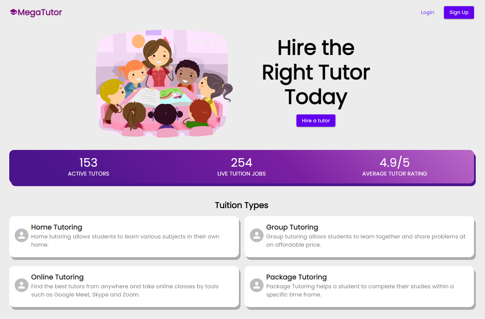

## Signup Page

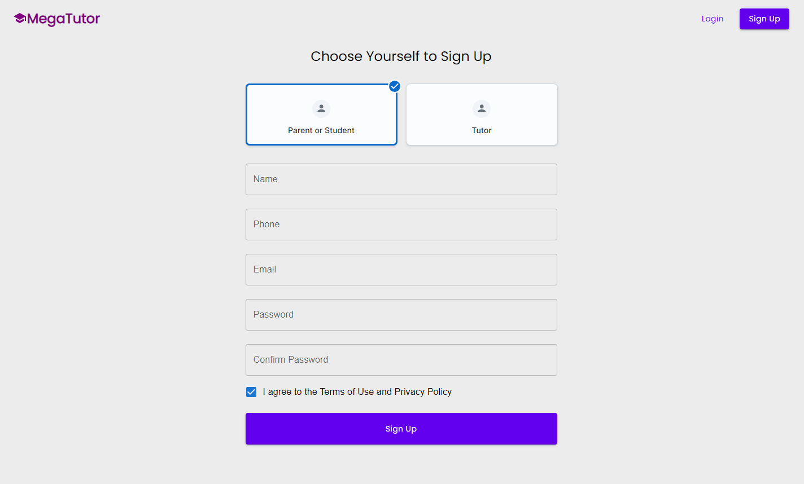

## Parent Dashboard

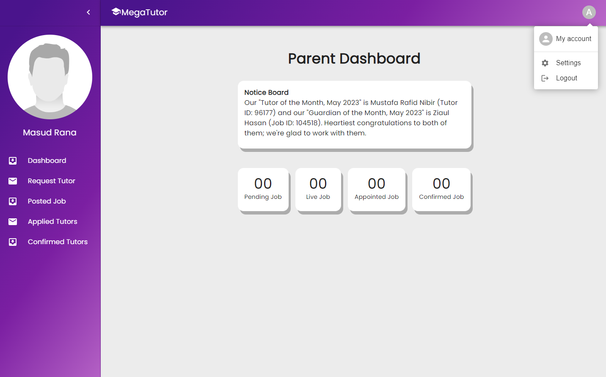

## Request Tutor

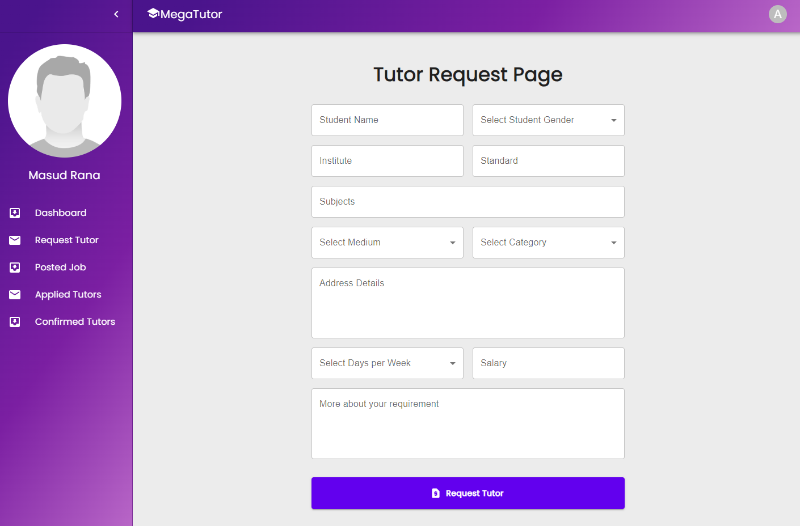

## Posted Jobs

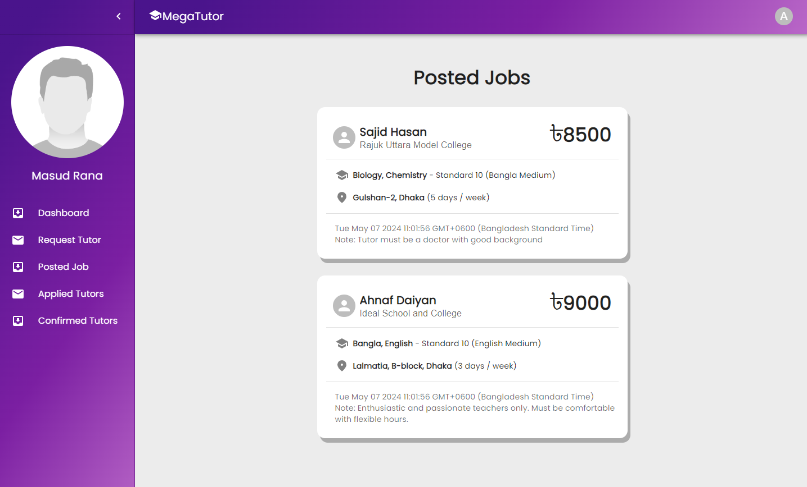

## Applied Tutors

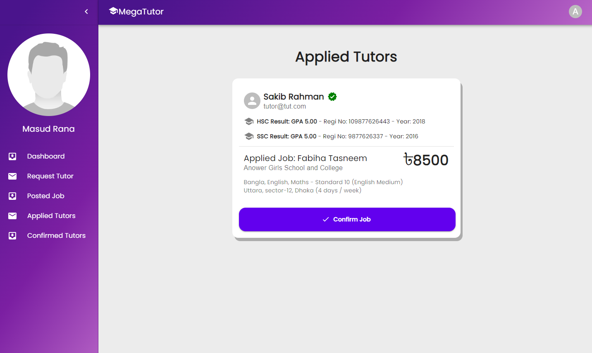

## Confirmed Tutors

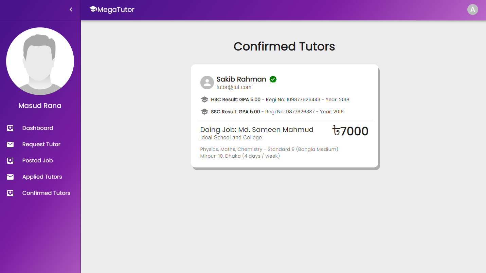

## Tutor Dashboard

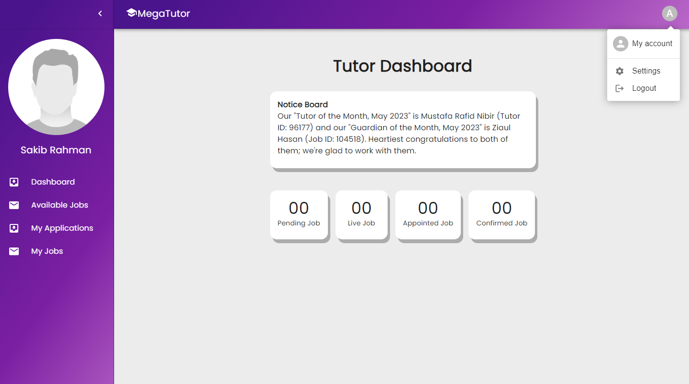

## Available Jobs

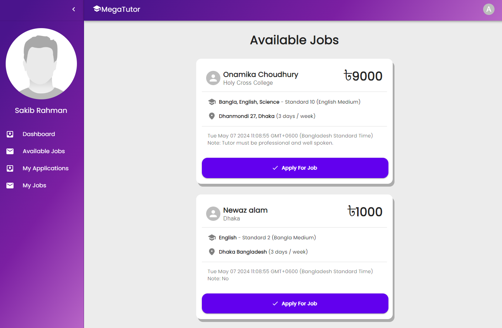

## My Applications

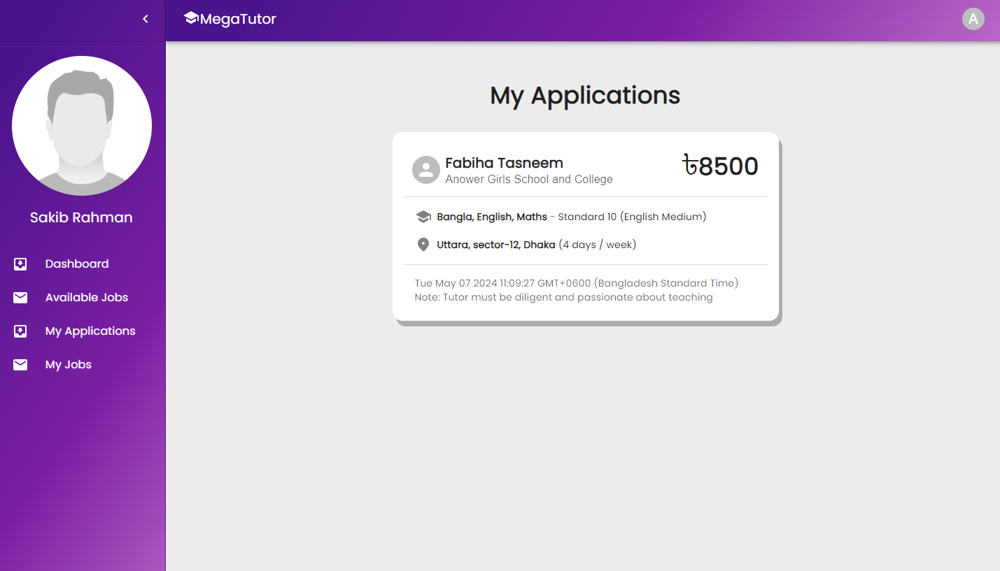

## My Jobs

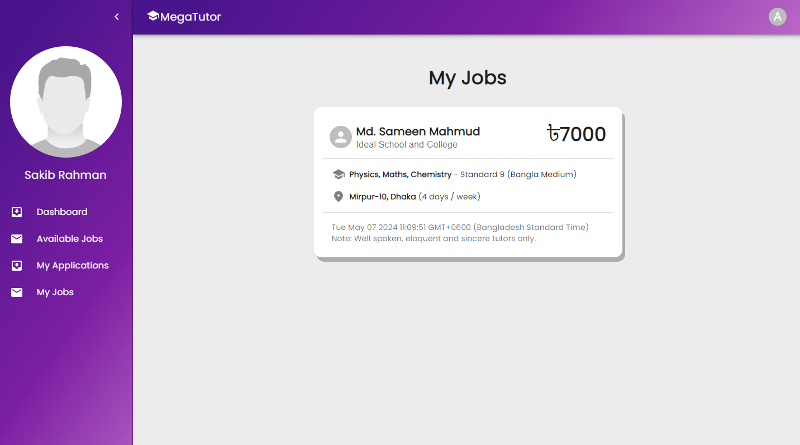
